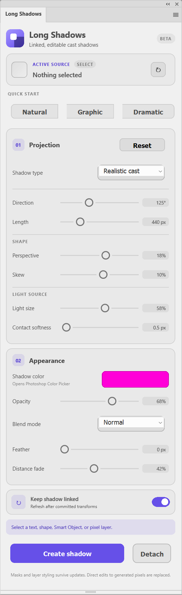

# Long Shadows for Photoshop

Create editable long and cast shadows directly inside Adobe Photoshop.

[](https://github.com/oosamasaad/long-shadows-photoshop/releases/latest)
[](https://www.adobe.com/products/photoshop.html)
[](https://developer.adobe.com/photoshop/uxp/)



## Download

**[Download Long Shadows for Photoshop (.ccx)](https://github.com/oosamasaad/long-shadows-photoshop/releases/latest/download/Long%20Shadows.ccx)**

Current release: **v0.1.0 Beta**

> This is an independently developed beta plugin and is not affiliated with or endorsed by Adobe.

## Features

- **Three projection modes**
  - Flat extrusion for clean graphic long shadows
  - Perspective projection with independent perspective and skew
  - Realistic cast mode with distance-based penumbra
- **Linked source and shadow**
  - Keeps a managed relationship with the original layer
  - Refreshes after committed move, scale, and rotation operations
  - Shadow remains on its own editable Photoshop layer
- **Independent controls**
  - Direction and length
  - Perspective and skew
  - Light size and contact softness
  - Photoshop's native color picker
  - Opacity and 27 Photoshop blend modes
  - Global feather and distance fade
- **Quick Start presets**
  - Natural
  - Graphic
  - Dramatic
- **Non-destructive workflow**
  - Preserves masks, layer opacity, blend mode, and layers placed above the generated shadow
  - Detach converts a managed shadow into an ordinary Photoshop layer
- **Photoshop-native experience**
  - Compact UXP panel
  - Dark, Darkest, Light, and Lightest theme support
  - Clear linked-layer state and update feedback

## Requirements

- Adobe Photoshop **24.4 or newer**
- Windows or macOS supported by the corresponding Photoshop version
- Adobe Creative Cloud Desktop for installing the `.ccx` package

## Install the packaged plugin

1. Download **Long Shadows.ccx** from the [latest release](https://github.com/oosamasaad/long-shadows-photoshop/releases/latest).
2. Double-click the downloaded `.ccx` file.
3. Follow the Creative Cloud installation prompt.
4. Restart Photoshop if it was already open.
5. Open **Plugins → Long Shadows → Long Shadows**.

Because this beta is distributed directly rather than through Adobe Marketplace, Creative Cloud may display an unverified-developer warning.

## Use Long Shadows

1. Select a visible text, shape, Smart Object, or pixel layer.
2. Pick a Quick Start preset or configure the controls manually.
3. Click **Create shadow**.
4. Move, scale, or rotate the source layer.
5. Leave **Keep shadow linked** enabled for automatic refresh after the transform is committed, or click **Update shadow** manually.

### Managed layer structure

The plugin creates a group containing the source and generated shadow:

```text
Long Shadow — Source name
├── Source name
└── Long Shadow [managed metadata]
```

The metadata stored in the generated layer name maintains the source relationship and settings inside the PSD. Renaming that managed shadow layer can break the link.

## Editing behavior

Safe across updates:

- Layer masks
- Layer opacity
- Blend mode
- Adjustment or paint layers placed above the generated shadow

Replaced during an update:

- Pixels painted directly onto the managed shadow layer

Use **Detach** before painting directly onto the generated pixels.

## Projection modes

| Mode | Best for | Behavior |
| --- | --- | --- |
| Flat extrusion | Logos, typography, graphic artwork | Creates a clean, consistent long shadow |
| Perspective | Posters and dimensional compositions | Adds fan perspective and skew controls |
| Realistic cast | Softer environmental shadows | Increases blur with distance using light-size and contact controls |

## Privacy

Long Shadows performs its rendering locally inside Photoshop. It does not require an account, network access, analytics, or telemetry.

## Current beta limitations

- Supports one light source and a flat receiving plane
- Updates happen after a transform is committed, not continuously while dragging
- Group layers cannot be used as source layers
- Very large sources and long projections can take additional processing time
- Direct edits to managed shadow pixels are regenerated on the next update

Planned experiments include multiple lights, curved receiving surfaces, more realistic lighting, and continuous transform previews.

## Troubleshooting

### The Create shadow button is disabled

Select a visible text, shape, Smart Object, or pixel layer. Groups are not supported as sources in this beta.

### The linked shadow does not update

Confirm **Keep shadow linked** is enabled, finish the active transform, then click **Update shadow**.

### The plugin reports a rendering error

Open the UXP Developer Tool logs and include the following when reporting the problem:

- Photoshop version
- Operating system
- Source layer type
- Document color mode and bit depth
- Full console error

## Load the source in UXP Developer Tool

1. Enable **Developer Mode** under Photoshop's plugin preferences.
2. Open Adobe UXP Developer Tool.
3. Choose **Add Plugin** and select `manifest.json`.
4. Click **Load** or **Load & Watch**.
5. Open the panel from Photoshop's **Plugins** menu.

## Project structure

```text
Long-Shadows/
├── assets/             Screenshot used in this README
├── icons/              Light and dark plugin/panel icons
├── index.html          Panel markup
├── styles.css          Theme-aware panel styling
├── index.js            UI state and Photoshop rendering
├── manifest.json       UXP plugin definition
└── README.md
```

## Feedback

This is an early public beta. Bug reports and focused feature suggestions are welcome through [GitHub Issues](https://github.com/oosamasaad/long-shadows-photoshop/issues).

